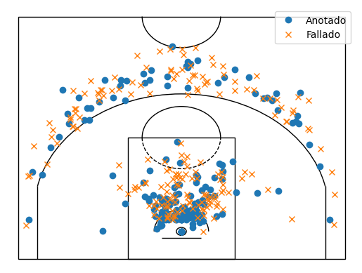

# ACB_Shot_Scraper


This project is a web scraper built using Python and Selenium to extract data about shots taken in ACB games. The scraper can obtain either the shots taken in a specific game or the shots taken by a particular player over the course of a season.

## Features

- **Data extraction**: Retrieve information about shots taken by a team in one game or by a single player.
- **Export functionality**: Save processed data in accessible formats such as CSV.

## Requirements

- Python 3.12 (tested only on Python 3.12)
- Libraries:
  - selenium
  - pandas
  - matplotlib
- Google Chrome (tested with version 131) and compatible ChromeDriver

All dependencies are specified in `requirements.txt`. 

## Installation

Clone the repository and set up the environment:

```bash
git clone https://github.com/PabloDMC/ACB_Shot_Scraper.git
cd ACB_Shot_Scraper
pip install -r requirements.txt
```
## Example
```python
# Instanciar clase.
from scraper import ScraperACB
musa = ScraperACB()

# Partidos de Dzanan Musa en la temporada 2021-2022.
partidos_musa = musa.obtener_id_partidos_jugador('30001170','2021')

# Se iteran los partidos que jugó Musa para obtener sus lanzamientos.
tiros_musa = []
for i in partidos_musa:
    tiros_musa.extend(musa.obtener_tiros_jugador('D. Musa',i))
musa.cerrar_driver()

# Conversión a dataframe.
import pandas as pd
df = pd.DataFrame(tiros_musa, columns=[
                    'nombre', 'x', 'y', 'cuarto', 'tiempo', 'equipo_local',
                    'resultado_local', 'resultado_visitante', 'equipo_visitante', 
                    'descripcion', 'anotado', 'id_partido',
                    'id_jornada', 'temporada', 'competicion', 'playoff'
                ])

# Transformacion lineal de las coordenadas de los tiros. 
import numpy as np
df = df.astype({'x':'float', 'y':'float'})
df['coord_x']=df['x']
df['coord_y']=df['y']
df['y'] = np.where((df['coord_x'] - 24.750) * 6 < 1400,
                      (df['coord_x'] - 24.750) * 6,
                      abs((df['coord_x'] - 24.750) * 6 - 2800))
df['x'] = np.where((df['coord_x'] - 24.750) * 6 < 1400,
                      (df['coord_y'] - 141.25) * 6,
                      -(df['coord_y'] - 141.25) * 6)

# Tiros realizados por Dzanan Musa durante su temporada de MVP (2021-2022)
from Pista import shot_chart
shot_chart(df[df['anotado']==True],df[df['anotado']==False])
```
## Dzanan Musa (2021-2022)

